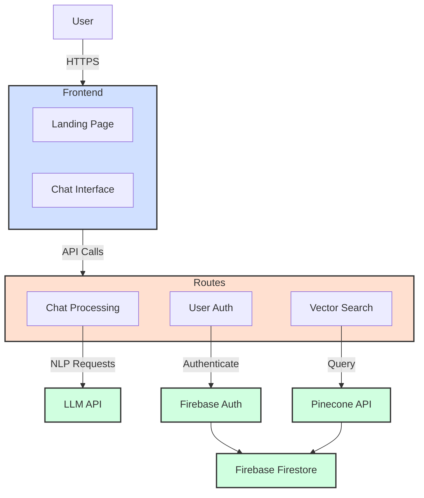

<pre style="background-color: black; color: white;">
## Getting Started

First, run the development server:

```bash
npm install
npm run dev
# or
yarn dev
# or 
pnpm dev
# or
bun dev
```

Open [http://localhost:3000](http://localhost:3000) with your browser to see the result.
</pre>
# MedServe: System Documentation

## Table of Contents
1. [Introduction](#1-introduction)
2. [System Architecture](#2-system-architecture)
3. [Key Components](#3-key-components)
4. [User Interface](#4-user-interface)
5. [Backend Services](#5-backend-services)
6. [AI Integration](#6-ai-integration)
7. [Database Design](#7-database-design)
8. [Authentication and Security](#8-authentication-and-security)
9. [API Documentation](#9-api-documentation)
10. [Deployment](#10-deployment)
11. [Development Workflow](#11-development-workflow)
12. [Troubleshooting](#12-troubleshooting)
13. [Future Enhancements](#13-future-enhancements)

## 1. Introduction

MedServe is an advanced health assistant application designed to provide users with instant access to accurate, AI-powered health information. We combine the best publicly available health knowledge, with the best AI tools able to efficiently provide that knowledge as needed. The system combines modern web technologies with artificial intelligence to create an interactive and informative experience for users seeking health-related advice.

### Key Features:
- AI-powered chat interface for health-related queries
- Integration with medical knowledge bases
- Responsive design for desktop and mobile use

### Tech Stack:
- Frontend: Next.js (React), Material-UI
- Backend: Node.js, Firebase
- AI: OpenAI GPT models, Pinecone vector database
- Authentication: Firebase Authentication
- Database: Firebase Firestore, Pinecone

## 2. System Architecture

MedServe AI follows a modern, serverless architecture leveraging cloud services for scalability and maintainability.

## High-Level Architecture Diagram



### Components:
1. **Next.js Frontend**: Serves the user interface and handles client-side logic.
2. **API Routes**: Serverless functions handling backend logic and external service integration.
3. **Multiple LLM Provider API's**: Provide natural language processing capabilities.
4. **Firebase Auth**: Manages user authentication.
5. **Firebase Firestore**: Stores user data and chat history.
6. **Pinecone Vector DB**: Stores and retrieves medical information for context-aware AI responses.

## 3. Key Components

### 3.1 Frontend Components

#### LandingPage (`src/app/page.js`)
The main entry point of the application, introducing users to MedServe AI.

Key features:
- Responsive design with Material-UI
- Introduction to MedServe AI capabilities
- Options to try the HealthBot or enter the full chat interface

#### ChatPage (`src/app/chat/page.js`)
The main chat interface for logged-in users.

Key features:
- Chat history sidebar
- Real-time chat interface
- New chat creation
- User authentication status management

#### Auth Component (`src/app/components/Auth.js`)
Handles user authentication processes.

Key features:
- Login and signup functionality
- Email/password and Google authentication options
- Integration with Firebase Authentication

#### PopupChat Component (`src/app/components/PopupChat.js`)
A floating chat widget for quick interactions with the AI assistant.

Key features:
- Minimizable chat interface
- Real-time AI responses
- Typing indicators for better user experience

### 3.2 Backend Components

#### Chat API Route (`src/app/api/chat/route.js`)
Handles chat requests and integrates with OpenAI and Pinecone.

Key features:
- OpenAI GPT model integration
- Pinecone vector search for relevant medical information
- Context-aware response generation

#### Firebase Utilities (`src/app/utils/firebase.js`)
Sets up Firebase services for the application.

Key features:
- Firebase app initialization
- Authentication service setup
- Firestore database initialization

## 4. User Interface

The user interface is built using React components and styled with Material-UI, ensuring a responsive and accessible design across devices.

### 4.1 Landing Page

The landing page (`src/app/page.js`) serves as the main entry point for users. It features:

- A hero section with a call-to-action
- Feature highlights of MedServe AI
- Options to try the HealthBot or access the full chat interface
- Login/Signup buttons

#### Key UI Components:
- `FeatureCard`: Displays individual features of the application
- `AppBar`: Navigation bar with authentication options
- `Modal`: For displaying the authentication form

### 4.2 Chat Interface

The chat interface (`src/app/chat/page.js`) is the core of the application, where users interact with the AI assistant. It includes:

- A sidebar with chat history
- The main chat area with message bubbles
- An input area for user messages
- A disclaimer about the nature of AI-provided information

#### Key UI Components:
- `ChatListContainer`: Displays the list of previous chats
- `ChatListItem`: Individual chat session in the sidebar
- `MainContent`: Contains the chat messages and input area
- `DisclaimerBox`: Informs users about the limitations of AI advice

### 4.3 Popup Chat

The popup chat (`src/app/components/PopupChat.js`) provides a floating chat interface for quick interactions. Features include:

- Minimizable chat window
- Real-time message display
- Typing indicators

#### Key UI Components:
- `StyledPaper`: The main container for the popup chat
- `ChatHeader`: Contains the title and close button
- `MessageBubble`: Displays individual messages
- `TypingIndicator`: Shows when the AI is generating a response

### 4.4 Styling

The application uses a combination of Material-UI's built-in styling system and custom styles:

- Theme customization in `src/app/page.js`
- Global styles in `src/app/globals.css`
- Component-specific styles using the `styled` function from Material-UI

## 5. Backend Services

The backend of MedServe AI is primarily serverless, utilizing Next.js API routes and cloud services.

### 5.1 API Routes

Located in `src/app/api/chat/route.js`, the main API route handles chat functionality:

1. Receives user messages
2. Queries Pinecone for relevant medical information
3. Sends context and user message to OpenAI
4. Returns AI-generated response to the frontend

### 5.2 Firebase Services

Firebase provides authentication and database services:

- **Authentication**: Handles user signup, login, and session management
- **Firestore**: Stores user data and chat history

Configuration and initialization of Firebase services are done in `src/app/utils/firebase.js`.

### 5.3 Pinecone Vector Database

Pinecone is used to store and retrieve medical information efficiently:

- Stores embeddings of medical information
- Provides fast similarity search for relevant context

The Pinecone service is initialized and queried in the chat API route.

## 6. AI Integration

MedServe AI leverages OpenAI's GPT models for generating intelligent responses to user queries.

### 6.1 OpenAI Integration

The application uses the OpenAI API to generate responses:

- Model: GPT-4 (or GPT-3.5-turbo, depending on configuration)
- Input: User message and relevant medical context
- Output: AI-generated response

The integration is handled in the chat API route (`src/app/api/chat/route.js`).

### 6.2 Context Enhancement

To provide more accurate and relevant responses, the system:

1. Queries Pinecone with the user's message
2. Retrieves relevant medical information
3. Includes this information as context when querying OpenAI

This process enhances the AI's ability to provide informed and contextually appropriate responses.

## 7. Database Design

MedServe AI uses two database systems: Firebase Firestore and Pinecone Vector Database.

### 7.1 Firebase Firestore

Firestore is used to store user data and chat history. The data model is as follows:
users/
{userId}/
conversations/
{conversationId}/
messages/
{messageId}/
content: string
createdAt: timestamp
userId: string
This structure allows for efficient retrieval of user-specific chat histories.

### 7.2 Pinecone Vector Database

Pinecone stores medical information as vector embeddings, allowing for fast similarity search:

- Each entry contains:
  - Vector embedding of medical text
  - Metadata including the original text and any relevant tags

The Pinecone database is queried in the chat API route to retrieve context for AI responses.

## 8. Authentication and Security

MedServe AI implements robust authentication and security measures to protect user data and ensure secure interactions.

### 8.1 User Authentication

Firebase Authentication is used to handle user signup and login processes:

- Email/password authentication
- Google Sign-In integration

The Auth component (`src/app/components/Auth.js`) manages the UI for these processes.

### 8.2 Security Measures

1. **Environment Variables**: Sensitive information like API keys are stored in environment variables (`.env.local`)
2. **Server-side API Calls**: OpenAI API calls are made server-side to protect API keys
3. **HTTPS**: All communications are encrypted using HTTPS
4. **Firebase Security Rules**: Firestore database access is controlled by Firebase security rules

### 8.3 Data Privacy

- User chat histories are stored securely in Firebase Firestore
- No personal health information is permanently stored
- Users are advised not to share sensitive personal information in chats

## 9. API Documentation

### 9.1 Chat API

**Endpoint**: `/api/chat`

**Method**: POST

**Request Body**:
json
{
  "messages": [
    {
      "role": "user",
      "content": "User's message here"
    }
  ],
  "chatId": "optional-chat-id"
}
### Error Responses:
- 400 Bad Request: Missing required parameters
- 500 Internal Server Error: Server-side processing error

### 9.2 Authentication API
Firebase Authentication is used, which provides RESTful endpoints for authentication operations. Refer to the [Firebase Authentication REST API documentation](https://firebase.google.com/docs/reference/rest/auth) for detailed information on these endpoints.

## 10. Deployment
MedServe AI is designed to be deployed on cloud platforms that support Next.js applications.

### 10.1 Deployment Steps
1. Set up environment variables on the deployment platform
2. Build the Next.js application: `npm run build`
3. Deploy the built application to the chosen platform (e.g., Vercel, Netlify)
4. Configure custom domain and SSL certificate if required

### 10.2 Environment Variables
Ensure the following environment variables are set:
- `NEXT_PUBLIC_FIREBASE_*`: Firebase configuration variables
- `OPENAI_API_KEY`: OpenAI API key
- `PINECONE_API_KEY`: Pinecone API key
- `PINECONE_ENVIRONMENT`: Pinecone environment
- `PINECONE_INDEX_NAME`: Pinecone index name

### 10.3 Continuous Integration/Continuous Deployment (CI/CD)
Set up a CI/CD pipeline to automate the deployment process:
1. Configure GitHub Actions or similar CI/CD tool
2. Set up automated testing before deployment
3. Configure automatic deployment to staging environment on pull requests
4. Set up manual approval for production deployments

## 11. Development Workflow

### 11.1 Setting Up the Development Environment
1. Clone the repository
2. Install dependencies: `npm install`
3. Set up local environment variables in `.env.local`
4. Run the development server: `npm run dev`

### 11.2 Code Style and Linting
- ESLint is used for code linting
- Prettier is used for code formatting
- Run linter: `npm run lint`

### 11.3 Testing
- Jest is used for unit and integration testing
- React Testing Library for component testing
- Run tests: `npm test`

### 11.4 Version Control
- Git is used for version control
- Follow conventional commit messages
- Create feature branches for new features or bug fixes
- Use pull requests for code reviews

### 11.5 Documentation
- Keep README and this documentation up to date
- Use JSDoc comments for function and component documentation
- Generate API documentation using tools like Swagger or Postman

## 12. Troubleshooting

### 12.1 Common Issues
1. **API Key Issues**: Ensure all API keys are correctly set in environment variables
2. **Firebase Configuration**: Verify Firebase configuration in `firebase.js`
3. **Pinecone Connection**: Check Pinecone API key and environment settings
4. **OpenAI API Errors**: Verify OpenAI API key and usage limits

### 12.2 Debugging Tools
- Use browser developer tools for frontend debugging
- Check server logs for backend issues
- Enable verbose logging in development environment
- Use logging service like Sentry for production error tracking

### 12.3 Performance Monitoring
- Implement application performance monitoring (APM) tools
- Monitor server response times and error rates
- Track AI response generation times

## 13. Future Enhancements
Potential areas for future development include:

1. Implement more sophisticated conversation management
   - Context retention across multiple messages
   - User preference learning

2. Add support for file uploads (e.g., medical reports)
   - Image analysis for visual symptoms
   - PDF parsing for medical documents

3. Enhance error handling and user feedback mechanisms
   - Implement error boundaries in React components
   - Provide more detailed error messages to users

4. Implement a user feedback and response rating system
   - Allow users to rate AI responses
   - Use feedback to improve AI training

5. Develop an admin panel for monitoring conversations and fine-tuning the AI
   - Dashboard for usage statistics
   - Tools for analyzing common queries and improving responses

6. Integrate with additional medical databases for more comprehensive information
   - Connect with public health databases
   - Integrate with electronic health record (EHR) systems

7. Implement multi-language support
   - Localization of UI elements
   - Multi-language AI response generation

8. Add voice input/output capabilities
   - Speech-to-text for user input
   - Text-to-speech for AI responses

9. Implement advanced analytics
   - User behavior analysis
   - Health trend identification

10. Enhance mobile experience
    - Develop native mobile apps
    - Optimize performance for low-bandwidth connections

By continuously improving and expanding the capabilities of MedServe AI, we aim to provide an increasingly valuable tool for users seeking health information and advice.

This is a [Next.js](https://nextjs.org/) project bootstrapped with [`create-next-app`](https://github.com/vercel/next.js/tree/canary/packages/create-next-app).

## Learn More

To learn more about Next.js, take a look at the following resources:

- [Next.js Documentation](https://nextjs.org/docs) - learn about Next.js features and API.
- [Learn Next.js](https://nextjs.org/learn) - an interactive Next.js tutorial.

You can check out [the Next.js GitHub repository](https://github.com/vercel/next.js/) - your feedback and contributions are welcome!

## Deploy on Vercel

The easiest way to deploy your Next.js app is to use the [Vercel Platform](https://vercel.com/new?utm_medium=default-template&filter=next.js&utm_source=create-next-app&utm_campaign=create-next-app-readme) from the creators of Next.js.

Check out our [Next.js deployment documentation](https://nextjs.org/docs/deployment) for more details.

