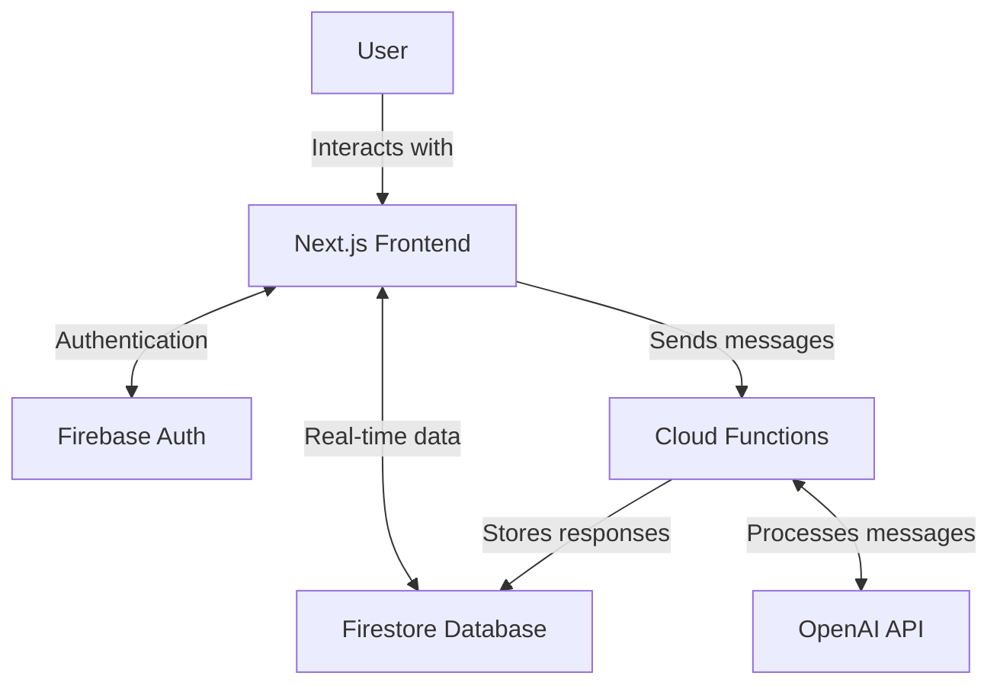

This is a [Next.js](https://nextjs.org/) project bootstrapped with [`create-next-app`](https://github.com/vercel/next.js/tree/canary/packages/create-next-app).

## Getting Started

First, run the development server:

```bash
npm run dev
# or
yarn dev
# or
pnpm dev
# or
bun dev
```

Open [http://localhost:3000](http://localhost:3000) with your browser to see the result.

You can start editing the page by modifying `app/page.js`. The page auto-updates as you edit the file.

This project uses [`next/font`](https://nextjs.org/docs/basic-features/font-optimization) to automatically optimize and load Inter, a custom Google Font.

## Learn More

To learn more about Next.js, take a look at the following resources:

- [Next.js Documentation](https://nextjs.org/docs) - learn about Next.js features and API.
- [Learn Next.js](https://nextjs.org/learn) - an interactive Next.js tutorial.

You can check out [the Next.js GitHub repository](https://github.com/vercel/next.js/) - your feedback and contributions are welcome!

## Deploy on Vercel

The easiest way to deploy your Next.js app is to use the [Vercel Platform](https://vercel.com/new?utm_medium=default-template&filter=next.js&utm_source=create-next-app&utm_campaign=create-next-app-readme) from the creators of Next.js.

Check out our [Next.js deployment documentation](https://nextjs.org/docs/deployment) for more details.

# Headstarter Chat: AI-Powered Technical Interview Preparation Assistant

## 1. Executive Summary

Headstarter Chat is an  AI-powered chat application designed to assist users in ___. Leveraging Open Router's language models and Firebase's real-time database and authentication services,Pinecone RAG, OPENAI EMbeddings

## 2. System Architecture

Headstarter Chat employs anarchitecture combining serverless functions, real-time database, and a responsive front-end. Here's a high-level overview of the system:



### Key Components:
1. **Next.js Frontend**: Provides a responsive and interactive user interface.
2. **Firebase Authentication**: Manages user authentication and session handling.
3. **Firestore Database**: Stores user data, conversations, and messages.
4. **Cloud Functions**: Processes user messages and interacts with the OpenAI API.
5. **OpenLLM API**: Generates intelligent responses based on the conversation context.

## 3. Detailed Component Breakdown

### 3.1 Next.js Frontend

The frontend is built using Next.js, a React framework that enables server-side rendering and efficient code splitting. Key features include:

- Responsive design using Tailwind CSS
- Real-time updates using Firebase hooks
- Client-side routing for smooth navigation between pages

**Key Files:**
- `src/app/page.js`: Main entry point and authentication page
- `src/app/chat/page.js`: Chat interface component
- `src/utils/firebase.js`: Firebase configuration and initialization

### 3.2 Firebase Authentication

We use Firebase Authentication to manage user sign-up, sign-in, and session handling. This provides:

- Secure user authentication
- Multiple sign-in methods (Email/Password, Google Sign-In)
- Seamless integration with other Firebase services

### 3.3 Firestore Database

Firestore is used as our real-time database, storing:

- User profiles
- Conversation metadata
- Individual chat messages

**Data Model:**
```
users/
  {userId}/
    conversations/
      {conversationId}/
        messages/
          {messageId}/
            content: string
            createdAt: timestamp
            userId: string
```

### 3.4 Cloud Functions

Cloud Functions serve as our serverless backend, handling:

- Message processing
- Integration with OpenAI API
- Storing AI-generated responses

**Key Function:** `processMessage`

This function:
1. Retrieves recent messages for context
2. Sends the context and new message to OpenAI API
3. Stores the AI response in Firestore

### 3.5 OpenAI API Integration

We use Open Router's GPT-3.5-turbo model , more to come soon. 

## 4. Key Features

1. **Real-time Chat**: Users can engage in real-time conversations with the AI assistant.
2. **Conversation History**: Past conversations are stored and can be revisited.
3. **Context-Aware Responses**: The AI considers recent messages when generating responses.
4. **Secure Authentication**: Multiple sign-in options with Firebase Authentication.
5. **Responsive Design**: Works seamlessly on desktop and mobile devices.

## 5. Development Workflow

1. **Local Development**: Use `npm run dev` to run the Next.js development server.
2. **Testing**: Implement unit tests for components and functions.
3. **Deployment**: 
   - Frontend: Deploy to Vercel or similar platform
   - Cloud Functions: Deploy using `firebase deploy --only functions`

## 6. Future Enhancements

1. Implement more sophisticated conversation management
2. Add support for code snippets and formatting
3. Integrate with external resources for more comprehensive answers
4. Implement user feedback and response rating system
5. Develop an admin panel for conversation monitoring and AI training

## 7. Conclusion

TBD
